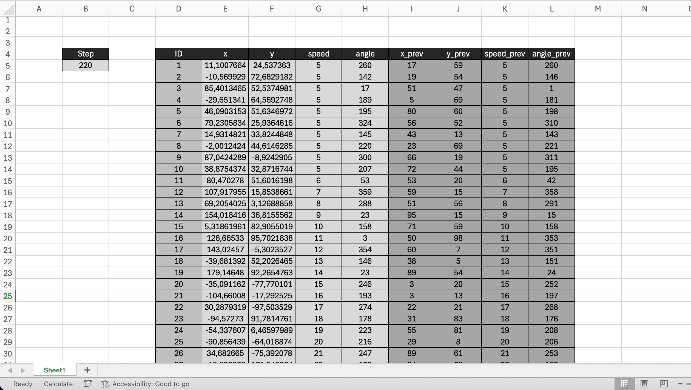

# Motion
The assignment is to model agents' motion in a two-dimensional space.

## Overview
The agents' motion is modelled using four properties: x coordinate, y coordinate, speed and angle. The x and y coordinates are reclaculated based on the agent's speed and current angle. The angle changes slightly and on random each step.

## Task
TODO

## Solution
TODO

## Result
Below is the screenshot of the resulting table.

