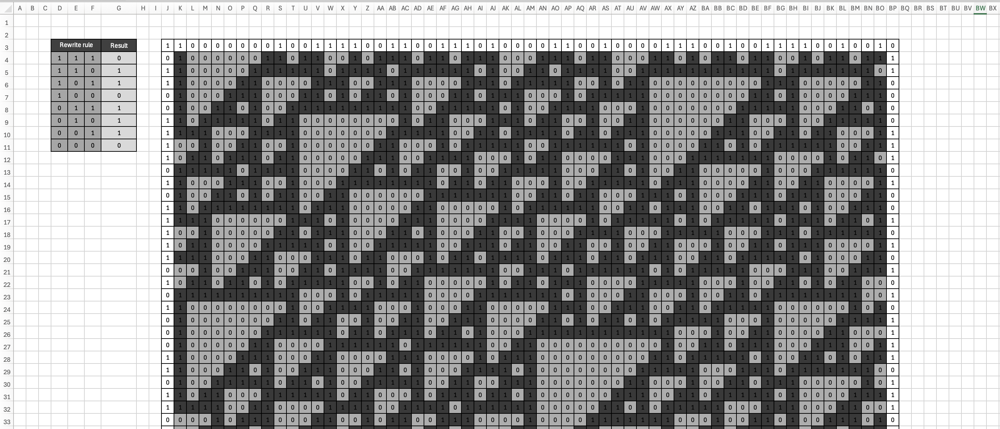

# Rule 110
The assignment is to model the Rule 110 cellular automaton.

## Overview
The Rule 110 automaton is an elementary cellular automaton, where a one-dimensional pattern of 0s and 1s evolves according to a simple set of rules. Whether a point in the pattern will be 0 or 1 in the new generation depends on its current value, as well as on those of its two neighbors.

The Rule 110 automaton has the following set of rules:
<table>
    <tr>
        <th>Current pattern</th>
        <th>111</th>
        <th>110</th>
        <th>101</th>
        <th>100</th>
        <th>011</th>
        <th>010</th>
        <th>001</th>
        <th>000</th>
    </tr>
    <tr>
        <th>New state for center cell</th>
        <td>0</td>
        <td>1</td>
        <td>1</td>
        <td>0</td>
        <td>1</td>
        <td>1</td>
        <td>1</td>
        <td>0</td>
    </tr>
</table>

## Task
The goal is to model the Rule 110 cellular automaton in Microsoft Excel, where the rows represent time progression and the columns represent the one-dimensional set of cell values.

Each cell's new value results from the set of rules by the top left, top and top right cells, since that is the state one unit of time before the current time.

## Solution
Initially, I created one cell with the following formula:
```
=INT(RAND()+0,5)
```
This formula randomly generates a value of either 0 or 1. Then, I created a full row of these values as the initial state of the automaton. In the same manner, I generated the first and last column to create boundaries for the model.

Then, I created a small table with the rules serving as the blueprint for the actual model rules to apply.

Finally, I formed the formula based on the rules and the neighbouring cells:
```
=
IF(AND(J3=$D$4;K3=$E$4;L3=$F$4);$G$4;
IF(AND(J3=$D$5;K3=$E$5;L3=$F$5);$G$5;
IF(AND(J3=$D$6;K3=$E$6;L3=$F$6);$G$6;
IF(AND(J3=$D$7;K3=$E$7;L3=$F$7);$G$7;
IF(AND(J3=$D$8;K3=$E$8;L3=$F$8);$G$8;
IF(AND(J3=$D$9;K3=$E$9;L3=$F$9);$G$9;
IF(AND(J3=$D$10;K3=$E$10;L3=$F$10);$G$10;
IF(AND(J3=$D$11;K3=$E$11;L3=$F$11);$G$11;
"none"))))))))
```
The formula is a simple chain of IF-ELSE conditions, one for each rule.

## Result
Below is the screenshot of the resulting table.

