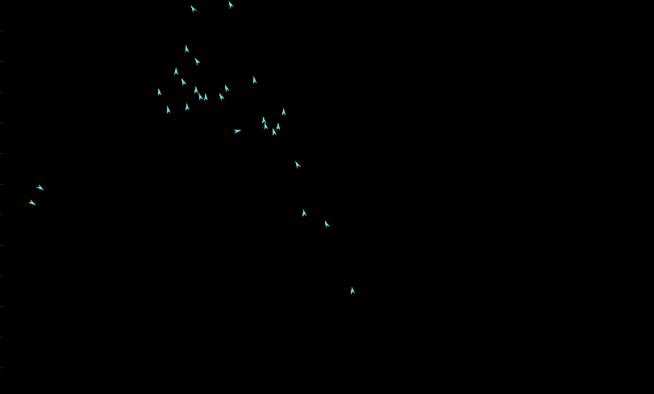

# Introduction to Agent-based Modeling

Agent-based modeling is a simulation technique used in many scientific fields to model and understand complex simulations. In an agent-based model, a system is modeled using a set of autonomous entities called agents. An agent represents a single, meaningful unit of a system, such as a person in an epidemic or a bird in a flock. Each agent individually assesses the current situation and makes decisions based on a set of defined rules. The main idea of agent-based modeling is to describe the system from the perspective of its constitutent units. This approach allows us to uncover novel emergent phenomena within the system that were previously unknown or considered improbable.

In technical terms, the simulation consists of three dimensions:
1. agents - a set of agents in the simulation
2. attributes - a set of attributes for each agent representing the rules based on which the agent decides
3. time - the time progression of the simulation represented in individual steps

Let's have a look at an example agent-based simulation representing bird flocking.

In this flocking simulation, each agent represents one bird. A bird has attributes such as the `x` and `y` coordinates, `speed` and `angle`, based on which it moves in the two-dimensional space. Based on certain rules, each bird (agent) finds its neigbours (other birds in its proximity) and steers towards the flock.

Agent-based simulations are useful in scenarios where we can assess the behaviour of individual units of the system and based on this behaviour we need to uncover the collective behaviour of the population. In this way, we can uncover phenomena that were previously unknown and come to new conclusions about the system that we model.